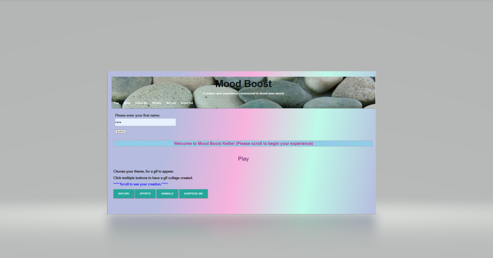
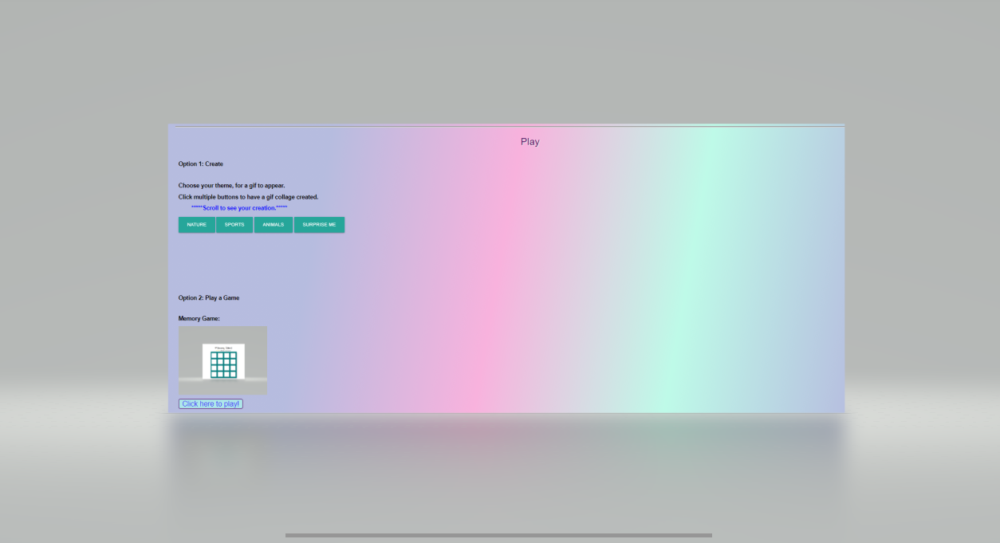
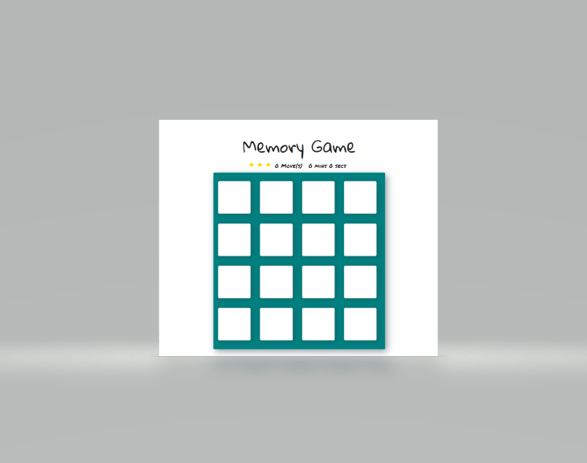
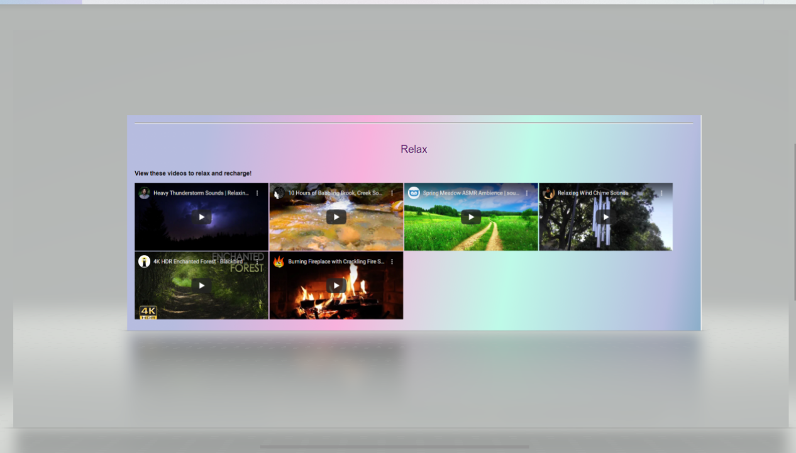
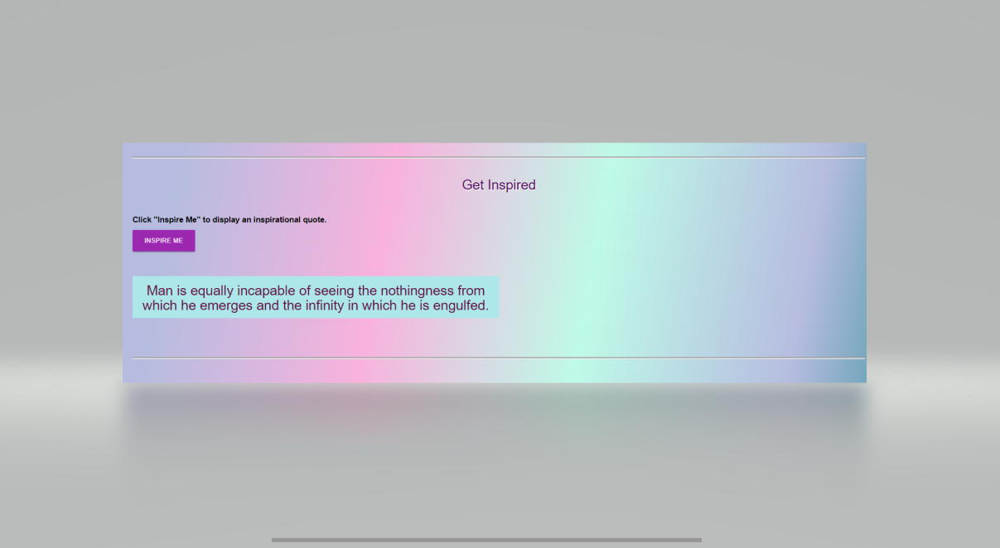
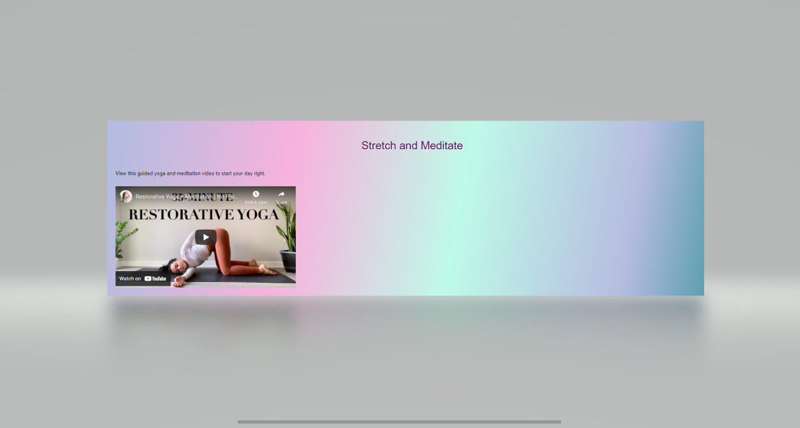
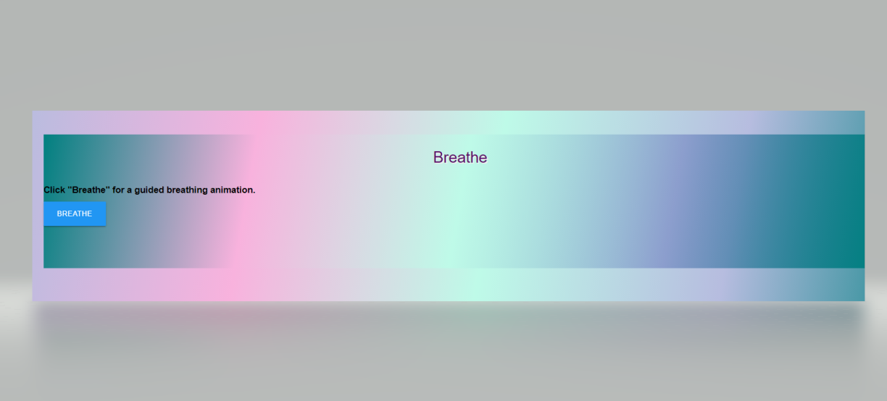
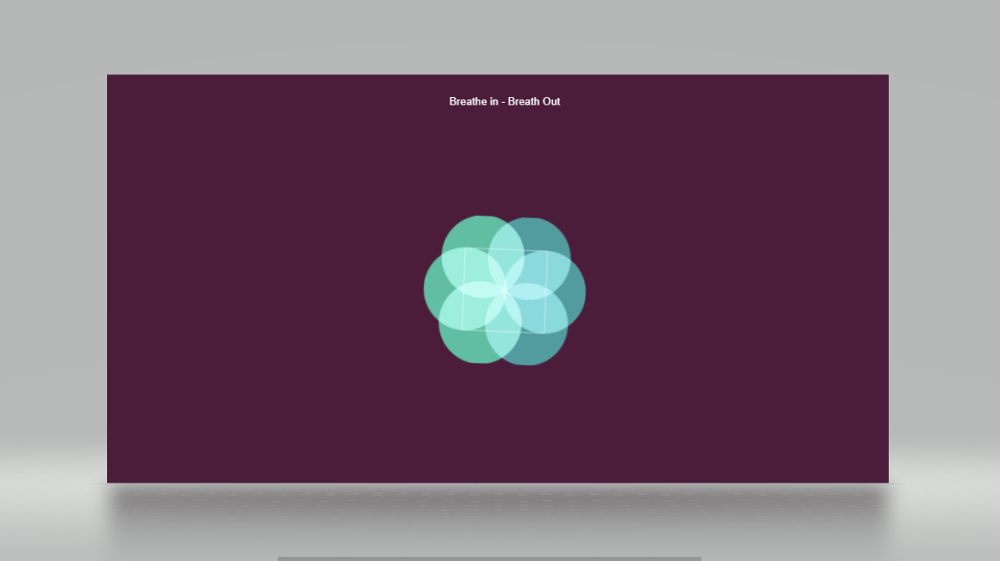

## Mood Boost

## Purpose
To provider a unique user experience customized to boost your mood. 

## Features
Personalized welcome message
Options to create a gif collage or play a memory game
On-screen video playback for relaxation and yoga
Inspirational quote display 
Guided breathing animation

## Built With
* HTML
* CSS
* JavaScript
* Materialize
* Jquery

## Server Side API's
https://api.giphy.com
https://type.fit/api/quotes

## Website
 https://kwerrell73.github.io/mood-boost/

## Screenshots

## Contribution
Created by Vanessa McGuire, and  Kellie Werrell :smile:

### ©️2021 Mood Boost

